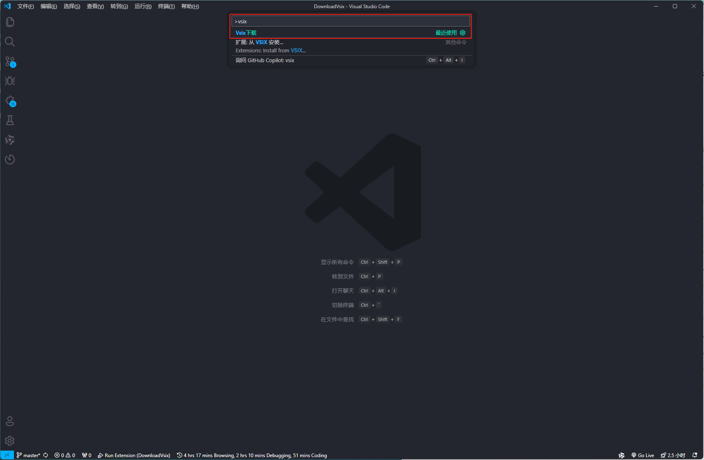
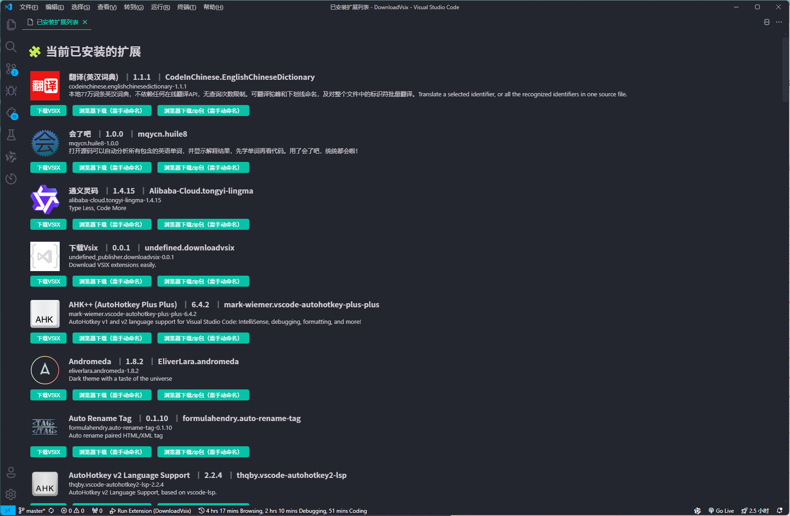

## 下载 Vsix 文件

## 🚀 快速开始
1. 下载插件后，在 VSCode 中，点击 `Extensions`（`扩展`） -> `Extension Marketplace`（`更多`） -> `Install from VSIX`（`从VSIX安装`） -> 选择下载的vsix文件
2. 在VSCode 中 按下 `Ctrl+Shift+P` 输入 `vsix` 打开`vsix 下载`页面
    
3. 自动检测本地已安装的VSCode插件，支持通过VSCode 或者 浏览器下载
    

## ❓ 可能遇到的问题
- 打开webView时，提示 `加载 Web 视图时出错: Error: Could not register service worker: InvalidStateError: Failed to register a ServiceWorker: The document is in an invalid state..`

    解决方法：
    在控制台输入以下命令
    ```sh
    code --no-sandbox
    ```
- 下载后长时间无反应
    可能是网络问题，尝试重新下载，或者使用浏览器下载
    下载完成后会在VSCode中通知的
    
## 开发
1. 安装依赖 `npm install`
2. 安装 vsce `npm i vsce -g`
3. 打包 `vsce package`